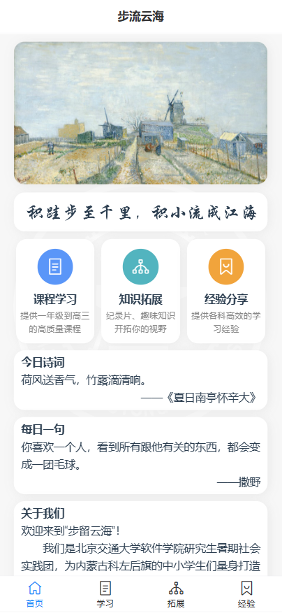
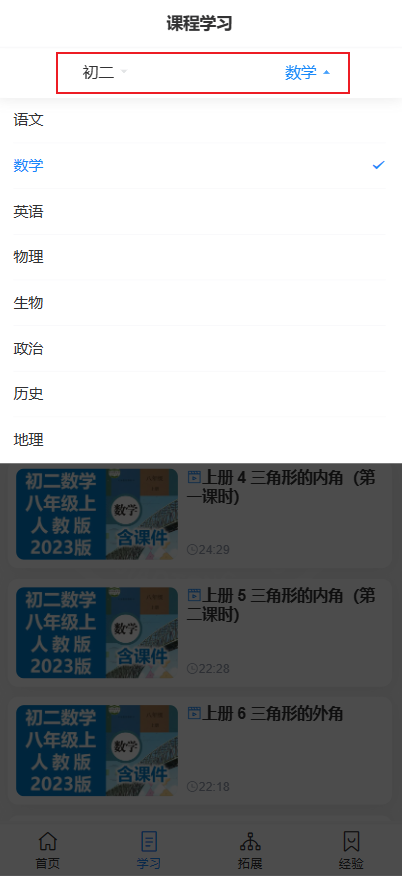
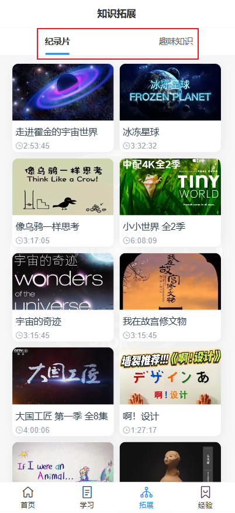
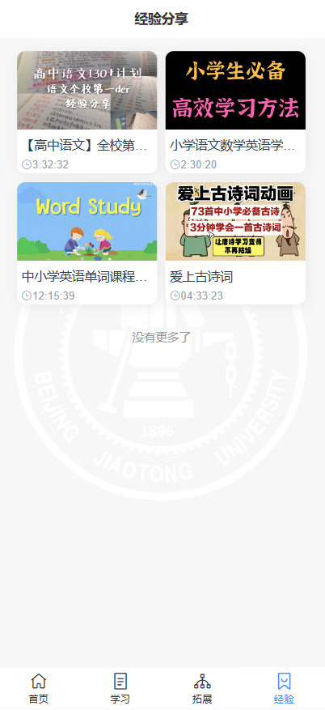

# bjtu-sse-edu

## 安装依赖&启动&打包

```sh
npm install
npm run dev
npm run build
```

## 部署到 github pages

### 第一次部署

```sh
npm run build
git checkout -b gh-pages
git push origin gh-pages
# 或者 deploy-gitee.sh
bash deploy-github.sh
```

### 后期部署

在Bash窗口中运行:

```sh
#部署到 github
bash deploy-github.sh
#部署到 gitee
bash deploy-gitee.sh
```

如果有问题，可以尝试删除dist后重新执行命令

## 系统介绍

> 本小程序（科左后旗学习小助手）是北京交通大学软件学院针对为科尔沁左翼后旗巴彦乌楞嘎查的情况，定制的一款视频学习资源小程序。主要包含了课程学习、知识拓展和经验分享三大模块。其中课程学习模块提供了从小学一年级到初中三年级的所有科目的线上视频课程，同学们可以在课后根据自身的薄弱点迅速找到相关课程进行复习或补充。知识拓展模块的目的是培养同学们的学习兴趣，该模块分为两个板块：纪录片板块和趣味知识。纪录片板块包括历史、科学、自然、文化到社会在内的多种主题。可以将学生带入不同的地方和文化，让了解世界的多样性和复杂性。在拓展视野的同时，激发学生洞察问题和思考问题的能力。趣味知识板块则是以提高学生的学习兴趣为主要目的，提供了趣味实验、自然现象的原理、社科人文在内的众多分析视频。经验分享模块收集了网络上许多优秀前辈的宝贵学习经验，同学们在学习过程中遇到困难或瓶颈都能在这个模块寻找是否有合适自己的经验建议。

### 软件目的

如今互联网的信息内容的爆发式增长使我们可以在网上找到任何我们想要的资料。但是，信息的检索并没有那么容易，特别是对于中小学生来说，在繁忙的学业之余要想系统地整理出互联网上的各科学习资料还是比较困难的。开发本小程序的目的就是帮助中小学生在鱼龙混杂的检索结果中选出高质量的视频资源，并分类到各个年级学科中，为学生们省去信息检索的过程。此外，程序提供一些拓展性的内容和学习经验分享，在内容上针对对学生的使用情况做了特别优化，使其更适合学生群体。

### 使用群体

任何对学习资源有需求的中小学生都可以使用这款小程序。

### 使用手册

#### 首页

首页主要负责内容的导航与信息展示。通过点击课程学习、知识拓展或经验分享图标，可快速跳转到相应模块。此外，首页还提供了今日诗句和每日一句小板块，分享有意思的诗词与句子。



#### 课程学习

在课程学习页的顶部有两个下拉选择栏可对各年级与学科进行过滤选择，帮助您迅速找到相应的课程资料。




#### 知识拓展

知识拓展页的顶部分为纪录片和趣味知识两个标签栏，点击即可快速切换。



#### 经验分享

经验分享页的只有一个板块，包含了所有经验分享视频资源。



#### 视频播放

视频播放页面主要包含视频播放器、标题显示以及选集功能。当一个视频带有多集内容时，可在视频播放页中快速切换选集。


